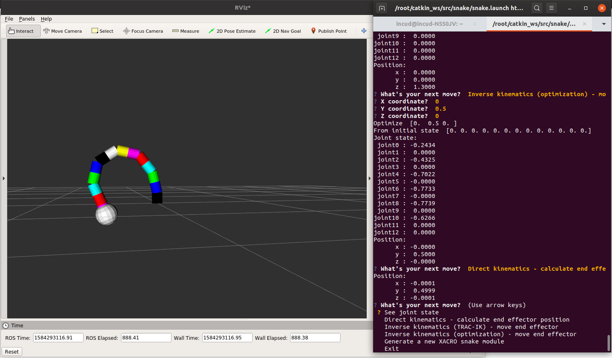
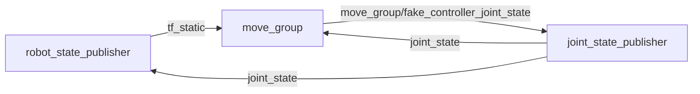

# Elaborato Robotica 

Elaborato per il corso di Robotica 2019/2020 dell'Università di Verona. 

Il progetto consiste nella modellazione di un robot continuo attraverso un numero finito ma arbitrario di componenti.

## Setup

Il modo più semplice di avviare l'applicazione è attraverso Docker. Nella directory _docker-ros_ è presente il necessario per avviare l'applicativo. L'immagine Docker si crea avviando da _docker-ros_ il comando:

```bash
sudo docker image build -t ros-for-exam:1.2 .
```

Una volta completato si avvia con i comandi

```bash
# X11 forwarding - permette la visualizzazione di applicazioni grafiche da Docker
xhost + 
# Se ho GPU NVIDIA uso `nvidia-docker` invece che `docker`
sudo docker run -it                                                       \
	--env="DISPLAY"                                                       \
	--volume="/tmp/.X11-unix:/tmp/.X11-unix:rw"                           \
	--volume="<mia directory dentro con snake>:/root/docker-ros-volume"   \ 
	ros-for-exam:1.2  bash
```

In caso di problemi di grafica, se possiedi GPU NVIDIA vedere https://github.com/NVIDIA/nvidia-docker/ ed https://github.com/NVIDIA/nvidia-docker/issues/136#issuecomment-398593070.

Per avviare il programma lanciare i comandi:

```bash
ROS_PYTHON_VERSION=3
cp -a /root/docker-ros-volume/snake /root/catkin_ws/src/ 
cd ~/catkin_ws 
catkin_make
source ~/catkin_ws/devel/setup.bash
roslaunch snake snake.launch
```

## Package `snake`

Il package è formato da un unico sorgente `ros_snake.py` che corrisponde ad un nodo ROS. Una volta avviato ti viene chiesto di selezionare una delle opzioni:

- *See joint state*: stampa lo stato dei giunti leggendo dal topic `joint_states`.
- *Direct kinematics - calculate end effector position*: legge lo stato dei giunti, calcola la cinematica diretta, stampa la posizione dell'end effector. Puoi confrontarla con quella stampata da RVIZ. 
- *Inverse kinematics (TRAC-IK) - move end effector*: muove l'end effector usando la liberia IK-fast.
- *Inverse kinematics (optimization) - move end effector*: muove l'end effector modellando il problema di cinematica inversa come un problema di ottimizzazione. La funzione da minimizzare è la distanza euclidea della posizione dell'end effector dal goal. Le variabili della funzione sono le variabili di giunto. Metodo lento ma super efficacie. 
- *Generate a new XACRO snake model*: genera un nuovo modello XACRO del robot. Il modello sarà composto da N link cilindrici di diametro D e lunghezza L (N, D, L in input). I giunti che collegano un link col precedente sono tutti rotoidali, su assi diversi (intervallo rotazioni sull'asse X ed Y). Sulla punta dell'ultimo link c'è l'end-effector sferico. 



### RVIZ

Selezionare _Global Option > Fixed Frame > link0_.

Premere _Add (in basso a sx) > Robot Model_.

### Lettura e scrittura del valore dei giunti

Per leggere i giunti creo un subscriver sul topic `/joint_state`. Per scrivere i giunti creo un publisher su `move_group/fake_controller_joint_state`. Segue schema sulla comunicazione dei componenti. Per approfondire vedi https://amslaurea.unibo.it/10919/1/Alessandro_Santoni_Thesis_(abstract_ITA).pdf capitolo 4. 



## Package `snake-openai`

Tentativo di implementare il calcolo della cinematica inversa usando algoritmi di machine learning. 

Per questo progetto **non serve avere installato ROS**. Serve solamente avere installato le librerie `tensorflow`, `keras`,`keras-rl`, `gym`.

Per prima cosa modelliamo il robot per mezzo di un oggetto `gym` di *OpenAI*. Questo ci permetterà di lavorare con diverse librerie, senza dover implementare da zero gli algoritmi. Tutto quello che dobbiamo fare è implementare alcune *api*:

- 

Per approfondire vedi https://ai-mrkogao.github.io/reinforcement%20learning/openaigymtutorial/ e https://mc.ai/creating-a-custom-openai-gym-environment-for-stock-trading/.

Creiamo un ambiente `SnakeGym` attraverso una classe astratta. Essa implementa:

- xxx

Implementiamo due classi concrete che ereditano da `SnakeGym`:

- `SnakeGymContinuous`:
- `SnakeGymDiscrete`:

